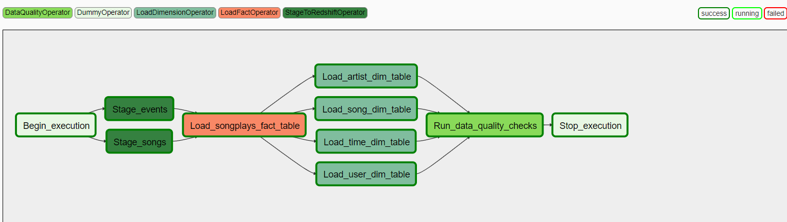

**Data-Pipelines-with-Airflow**

***Introduction***

A music streaming company, Sparkify, has decided that it is time to introduce more automation and monitoring to their data warehouse ETL pipelines and come to the conclusion that the best tool to achieve this is Apache Airflow.

They have decided to bring you into the project and expect you to create high grade data pipelines that are dynamic and built from reusable tasks, can be monitored, and allow easy backfills. They have also noted that the data quality plays a big part when analyses are executed on top the data warehouse and want to run tests against their datasets after the ETL steps have been executed to catch any discrepancies in the datasets.

The source data resides in S3 and needs to be processed in Sparkify's data warehouse in Amazon Redshift. The source datasets consist of CSV logs that tell about user activity in the application and JSON metadata about the songs the users listen to.

***Sources***
The sources are the same than previous projects:

* Log data: s3://udacity-dend/log_data
* Song data: s3://udacity-dend/song_data

***Destinations***

1. Staging Tables

- Stage_events
- Stage_songs

2. Fact Table:

- songplays
  
3. Dimension Tables

- users - users in the app
- songs - songs in music database
- artists - artists in music database
- time - timestamps of records in songplays broken down into specific units

***Prerequisites***

- Execute the queries in create_tables.py either in redshift query editor or via code to create the tables.

***Project Structure***
 
- create_tables.sql - Contains the DDL for all tables used in this projecs
- dags
    * udac_example_dag.py - The DAG configuration file to run in Airflow
- plugins
    * operators
        >* stage_redshift.py - Operator to read files from S3 and load into Redshift staging tables
        >* load_fact.py - Operator to load the fact table in Redshift
        >* load_dimension.py - Operator to read from staging tables and load the dimension tables in Redshift
        >* data_quality.py - Operator for data quality checking
- helpers
    * sql_queries - Redshift statements used in the DAG

***ETL Process***

 

 Above is the dag created by for the sparkify etl_process. Below are short description of each component --

 1. Begin Execution -- Kickstarts the dag execution
 2. Staging Phase -- Stage events & stage songs are for loading data into temporary staging tables. These reads logs & songs data respectively and loads into their specific staging tables.
 3. Load Songplays table -- Loads  data into fact table called songplays.
 4. Load Dimenssions -- Data is loaded into different dimenssion tables --
    * Artists
    * Users
    * Songs
    * Time
  5. Data Quality -- All the dimenssion tables goes via a data quality check for detecting any error in the etl_process. 

